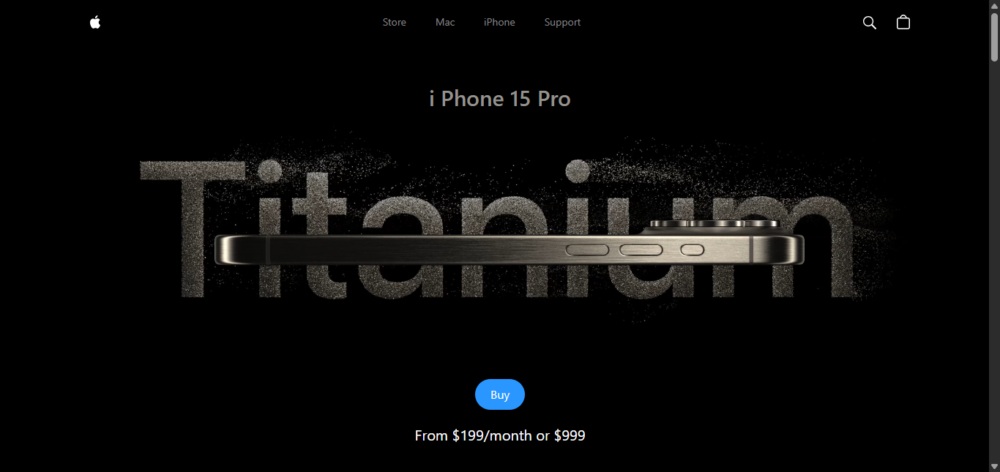

# 📱 3D iPhone Showcase

An interactive 3D iPhone product showcase built using **React**, **Three.js**, and **GSAP**. This project demonstrates smooth 3D animations, camera transitions, and scroll-based interactivity in a modern web environment.

🚀 **Live Demo**: [https://iphone-pearl-seven.vercel.app](https://iphone-pearl-seven.vercel.app)

---

## 🧰 Technologies Used

- **React.js** – Frontend UI framework
- **Three.js** – WebGL 3D graphics engine
- **GSAP (GreenSock Animation Platform)** – Smooth, timeline-based animations
- **React Three Fiber** – React renderer for Three.js
- **Vite** – Build tool for lightning-fast development
- **Vercel** – Deployment platform

---

## 🎯 Features

- 3D iPhone model rendered in-browser
- Smooth scroll-triggered animations
- Dynamic lighting and camera movement
- Responsive layout for modern devices
- Performant real-time rendering

---

## 🖼️ Preview





---

---

## ⚙️ Installation & Setup

```bash
# 1. Clone the repo
git clone https://github.com/hilla10/iphone.git
cd iphone-showcase

# 2. Install dependencies
npm install

# 3. Start the development server
npm run dev
```

🧠 What I Learned
- Working with 3D assets and camera controls using Three.js

- Creating timeline animations with GSAP

- Using React Three Fiber for integrating Three.js into React

- Optimizing 3D performance for the web

📌 Note
This project is for educational and portfolio purposes. The iPhone model and visuals are used for demonstration only and are not affiliated with Apple Inc.

👨‍💻 Author
Hailemichael Negusse
GitHub: [hilla10](https://github.com/hilla10)

📄 License
This project is open-source and available under the [MIT License](./License)

